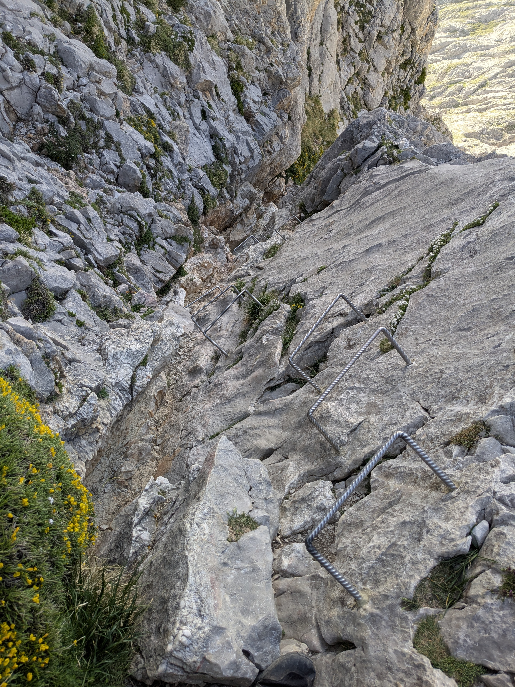
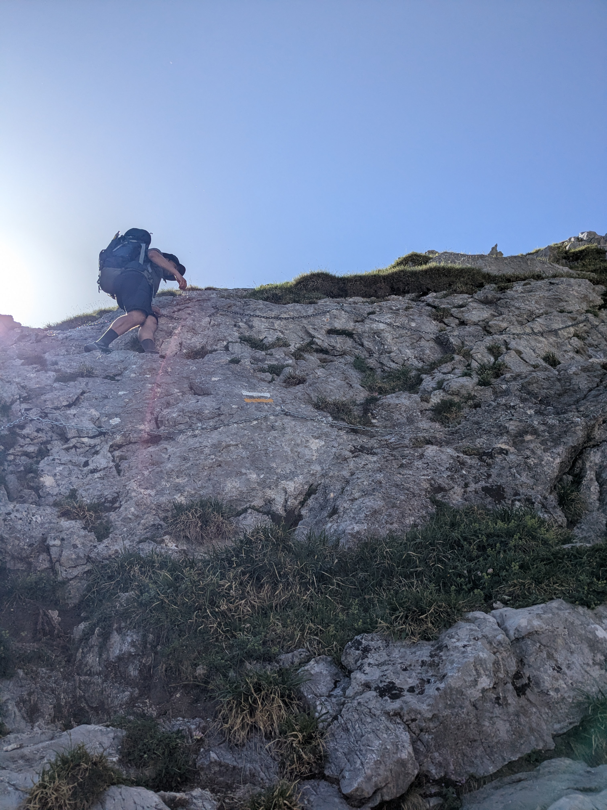
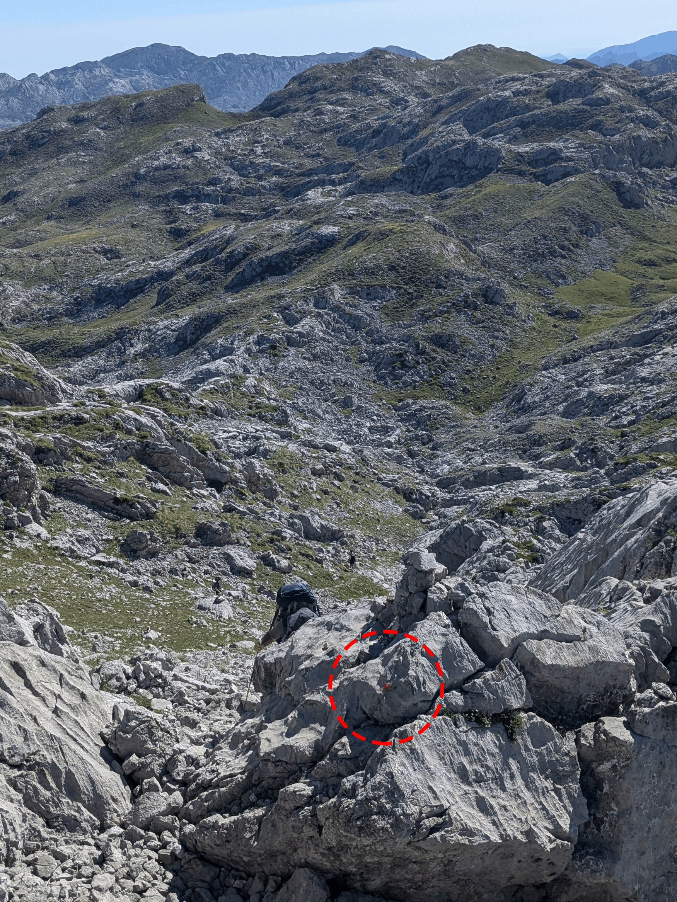

+++
title = 'El Anillo de Picos en 7 jours'
date = 2026-07-14T10:48:22+01:00
draft = false
description = ""
categories = ["rando", "espagne", "picos de europa"]
cover = "index.png"
+++

Après avoir réalisé au mois de juin une version personnalisée de l'Anillo de Picos (AP) dans le parc des _Picos de Europa_, j'ai eu l'envie de partager cet itinéraire sur sept jours qui m'a semblé intéressant, notamment parce qu'il permet de voir quasiment la totalité du parc. Alors si comme moi vous n'avez qu'une semaine devant vous, c'est peut-être une option intéressante ! 
Je vous listerai également toutes mes astuces pour ce très beau trek.

> NB. Les traces gps sont celles que j'ai enregistrées avec ma montre, à l'exception de la section de Bulnes.

# En bref
Pour faire court, le trek de l'AP peut être considéré comme **difficile**. Il est parfois comparé au GR20, à juste titre selon moi, du moins en termes de technicité.

L'eau est un vrai problème car il y a peu de sources et les rivières sont souvent polluées par les animaux. Je vous conseille d'emporter au minimum **trois litres** d'eau par jour ainsi qu'un filtre ou des pastilles de chlore.

A contrario, la nourriture est très facile à trouver, puisque tous les refuges gardés vous proposeront des plats ou des tapas à des prix corrects (de 13 à 16€ pour le plat). On trouve même parfois des bières pression vraiment pas chères ! Nous n'avons jamais dormi en refuge et le bivouac est gratuit (contrairement au GR20). Si vous comptez dormir en refuge, réservez bien en avance sur [leur site](https://elanillodepicos.com/reservas/).

Si vous avez peur du vide, de l'escalade, et des passages chaînés, réfléchissez-y à deux fois, ce n'est pas un circuit pour les "débutants", même si aucune difficulté n'est insurmontable.

Enfin, faites très attention aux cartes papier que vous pourrez trouver, certaines (comme la mienne, aux éditions _Editorial Alpina_) ne sont pas à jour et vous feront emprunter des passages dangereux. De même, vérifiez bien les fichiers gpx que vous trouverez en ligne.

L'influenceuse belge Floor Denil a publié [un guide](https://floordenil.com/fr/produit/anillo-de-picos-guide/) que j'ai pu consulter en discutant avec d'autres randonneurs, et qui m'a semblé être de très bonne qualité.

Petite note supplémentaire : quasiment personne ne parle anglais dans ces montagnes, c'est l'occasion de réviser vos bases d'espagnol du lycée !

**Légende** : 
* ⭐ Niveau de difficulté (1 à 3)
* ⛓️ présence de chaînes
* 🧗 passages de grimpette
* 💧 sources d'eau présentes sur l'étape

# Circuit complet

Si vous êtes pressé, voici la [trace complète](complete.gpx "download") à télécharger directement. Ci-dessous, le détail de chaque étape, à télécharger individuellement, et tous les conseils qui vont avec.

<iframe src="https://www.komoot.com/tour/3110846788/embed?share_token=aoVCmHm7WmvuP6dwIUDaSuw3JsD6Fn2vFEaBXYsmlzpcf4pLc6&amp;hl=fr&amp;layout=classic&amp;profile=1" width="100%" height="700" frameborder="0" scrolling="no"></iframe>

# Jour 1 - De Posada de Valdeón au refuge de Collado Jermoso

<iframe src="https://www.komoot.com/tour/3110296014/embed?share_token=aAHVB7j1v3jloQbSSAZvGfD9mEUc4aTAkYjHb5I9u4416IebJX&amp;hl=fr&amp;layout=compact" width="100%" height="260" frameborder="0" scrolling="no"></iframe>

* ⭐⭐ ⛓️ 🧗
* 💧 : **Aucun** point d'eau sur la route 
* À **Collado Jermoso** : eau, nourriture et toilettes
* [Télécharger le fichier .gpx](day1.gpx "download")
* [Voir sur Komoot](https://www.komoot.com/fr-fr/tour/3110296014?share_token=aAHVB7j1v3jloQbSSAZvGfD9mEUc4aTAkYjHb5I9u4416IebJX&ref=profile&t_s=referral&t_cid=route_share&t_ref_username=1058677099705)
* [Voir l'étape "sur le vif"](../../adventures/El%20Anillo%20de%20Picos/Posada%20de%20Valdeón%20-%20Collado%20Jermoso/index.fr.md)

Si vous arrivez du nord de l'Espagne, comme c'est mon cas, Posada de Valdeón n'est clairement pas la ville la plus simple à atteindre en voiture. Néanmoins, c'est un excellent point de départ, avec hôtels et restaurants, et une très bonne ambiance. Beaucoup de sportifs s'y retrouvent. Nous avons laissé la voiture sur une place de parking pendant la semaine, même si ce n'est peut-être pas particulièrement recommandé. 

L'étape n'est pas très technique, malgré un passage avec des chaînes assez tôt dans la journée. Par contre le dénivelé est brutal, avec notamment des portions à plus de 45% peu avant le refuge. Attention, il n'y a **pas d'eau** sur cette étape, veillez à en emporter suffisamment.

# Jour 2 - Du refuge Collado Jermoso à Sotres

<iframe src="https://www.komoot.com/tour/3110444276/embed?share_token=aiSPHUo8XuLIV8AKZxjkRxGF1tI23z4KZR8bdKEQOaQp0G6rEy&amp;hl=fr&amp;layout=compact" width="100%" height="260" frameborder="0" scrolling="no"></iframe>

* ⭐⭐ 🧗
* 💧 : Cabaña Verónica (payant) ; avant l'hôtel Aliva près de la bergerie ; à la sortie du village abandonné sur la route de Sotres
* [Télécharger le fichier .gpx](day2.gpx "download")
* [Voir sur Komoot](https://www.komoot.com/fr-fr/tour/3110444276?share_token=aiSPHUo8XuLIV8AKZxjkRxGF1tI23z4KZR8bdKEQOaQp0G6rEy&ref=profile&t_s=referral&t_cid=route_share&t_ref_username=1058677099705)
* [Voir l'étape "sur le vif"](../../adventures/El%20Anillo%20de%20Picos/Collado%20Jermoso%20-%20Sotres/index.fr.md)
* À **Cabaña Verónica** : eau (en bouteille) et nourriture
* À **Sotres** : hôtels, auberge et restaurants

Cette étape se décompose en deux parties, d'abord l'on rejoint le refuge Cabaña Verónica, avant d'entamer une longue redescente vers le village de Sotres. 

La première partie est certainement l'une des plus techniques du voyage. Entre les longs pierriers à traverser et surtout les passages sur les arêtes de grès qui forcent une attention de tous les instants, c'est assez épuisant mais le paysage en vaut la peine.

> ⚠️ Une fois passé Cabaña Verónica, un chemin est censé rejoindre le refuge Vega de Uriellu, cependant il a été **détruit** en 2023 et n'est toujours pas sécurisé, à l'été 2026. Cet itinéraire est extrêmement dangereux, nous avons renoncé à l'emprunter pour faire plutôt le grand tour par Sotres et je vous invite à faire de même.

Après le refuge, redescendre vers le téléphérique de Fuente Dé, et bifurquer avant la gare, vers l'hôtel Aliva. Avant d'arriver à Sotres, l'AP bifurque pour repartir dans la montagne vers le refuge Caseton de Andara. Nous avons décidé de ne pas suivre cette route, qui aurait nécessité un jour de voyage supplémentaire.

Sotres est très touristique, pensez à réserver une chambre à l'avance, il n'y a pas de camping et le bivouac serait compliqué aux abords du village. Nous avons dormi (en dortoir) à [l'Auberge Peña Castil](https://www.xn--alberguepeacastil-oxb.es/), que nous avons beaucoup aimé.

# Jour 3 - De Sotres au refuge d'Uriellu

<iframe src="https://www.komoot.com/tour/3110555324/embed?share_token=aqdT7HdTvOMba6xTlfgAgMp2g6Y2CtzRudiLfXMnlbooWhdYhL&amp;hl=fr&amp;layout=compact" width="100%" height="260" frameborder="0" scrolling="no"></iframe>

* ⭐
* 💧 : Refuge Terenosa
* [Télécharger le fichier .gpx](day3.gpx "download")
* [Voir sur Komoot](https://www.komoot.com/fr-fr/tour/3110555324?share_token=aqdT7HdTvOMba6xTlfgAgMp2g6Y2CtzRudiLfXMnlbooWhdYhL&ref=profile&t_s=referral&t_cid=route_share&t_ref_username=1058677099705)
* [Voir l'étape "sur le vif"](../../adventures/El%20Anillo%20de%20Picos/Sotres%20-%20Uriellu/index.fr.md)
* À **Uriellu** : eau et nourriture (pas de toilettes si bivouac)

Cette étape est l'une des plus faciles techniquement. On remonte jusqu'au refuge d'Uriellu, en passant par le petit refuge de la Terenosa, où l'on peut recharger ses batteries et faire le plein de victuailles.

Le refuge d'Uriellu est un haut lieu de l'escalade, aussi les randonneurs y semblent moins à leur aise. Si vous en avez l'énergie, je vous recommande de pousser jusqu'au refuge suivant, _del Jou de los Cabrones_, où l'accueil nous a semblé meilleur. Attention cependant, il y a plusieurs difficultés en route, soyez donc sûr d'avoir l'énergie requise ! Si vous prenez cette option cependant, l'étape du lendemain sera peut-être un peu courte, sauf si vous décidez de dépasser Bulnes et de bivouaquer, ce qui peut être compliqué le long de la _Ruta del Cares_.

# Jour 4 - D'Uriellu à Bulnes

<iframe src="https://www.komoot.com/tour/3110590512/embed?share_token=a0ANs0XN5W5F7zNMNbo78abDYezv39mgARAT26C8u6tEbo70YT&amp;hl=fr&amp;layout=compact" width="100%" height="260" frameborder="0" scrolling="no"></iframe>

* ⭐⭐ ⛓️ 🧗
* 💧 : Refuge _del Jou de los Cabrones_ 
* [Télécharger le fichier .gpx](day4.gpx "download")
* [Voir sur Komoot](https://www.komoot.com/fr-fr/tour/3110590512?share_token=a0ANs0XN5W5F7zNMNbo78abDYezv39mgARAT26C8u6tEbo70YT&ref=profile&t_s=referral&t_cid=route_share&t_ref_username=1058677099705)
* [Voir l'étape "sur le vif"](../../adventures/El%20Anillo%20de%20Picos/Uriellu%20-%20Rio%20Cares/index.fr.md)
* À **Bulnes** : hôtels et restaurants

Le début de la journée présente quelques difficultés, avec notamment une petite échelle à gravir et une crête venteuse à traverser. Au refuge _del Jou de los Cabrones_, pensez à reprendre des forces pour la suite, car vous aurez de nouveau deux beaux passages chaînés assez vertigineux. Mis à part ces difficultés, le reste de la journée est relativement facile et très plaisant.

À cause de ma carte papier défaillante, nous n'avons pas rejoint Bulnes, mais sommes descendus via le _canal de Piedra Bellida_ dans les gorges, sur les bords du Rio Cares. Cet itinéraire n'est pas du tout adapté, ni agréable. La pente est très raide et l'on descend dans un pierrier pendant deux kilomètres. Si vous souhaitez à tout prix éviter le "détour" par Bulnes (qui est un magnifique village), vous pouvez retrouver ma trace dans l'article "sur le vif".

# Jour 5 - De Bulnes à Vega de Ario

<iframe src="https://www.komoot.com/tour/3110595425/embed?share_token=aFTZ2fxCddGksPuxiGogYgJMAsin47YRhrgZH5nCJZyUipPbSw&amp;hl=fr&amp;layout=compact" width="100%" height="260" frameborder="0" scrolling="no"></iframe>

* ⭐⭐ 🧗
* 💧 : Puente Bollin (après le pont) 
* [Télécharger le fichier .gpx](day5.gpx "download")
* [Voir sur Komoot](https://www.komoot.com/fr-fr/tour/3110595425?share_token=aFTZ2fxCddGksPuxiGogYgJMAsin47YRhrgZH5nCJZyUipPbSw&ref=profile&t_s=referral&t_cid=route_share&t_ref_username=1058677099705)
* [Voir l'étape "sur le vif"](../../adventures/El%20Anillo%20de%20Picos/Rio%20Cares%20-%20Vega%20de%20Ario/index.fr.md)
* À **Vega de Ario** : eau et nourriture (pas de toilettes si bivouac)

Forcément, si vous avez dormi à Bulnes, cette étape va être longue. La première partie est cependant assez facile, puisqu'elle consiste à longer la magnifique _Ruta del Cares_. Lorsque vous arriverez à l'embranchement vers un chemin très abrupt pour monter au refuge, prenez le temps de continuer sur cinquante mètres, vers le pont qui traverse les gorges : la source d'eau est de l'autre côté.

Ensuite, prenez votre courage à deux mains : la montée est très longue et difficile. Une fois arrivé au sommet de la crête, soyez particulièrement attentif au tracé, il n'est quasiment pas matérialisé, mais part vers l'ouest. Il faut donc se déporter quelque peu. 

Le refuge de Vega de Ario est celui où vous trouverez la meilleure nourriture et sans doute la bière pression la moins chère, profitez-en !

# Jour 6 - De Vega de Ario à Vega Huerta

<iframe src="https://www.komoot.com/tour/3110675085/embed?share_token=aOPldukkLWA1PnSku3jeAu47UoIVTwJIQ6SAXpmEMYahRFzR3I&amp;hl=fr&amp;layout=compact" width="100%" height="260" frameborder="0" scrolling="no"></iframe>

* ⭐⭐⭐ 🧗
* 💧 : Refuge _Vega de Vegarredonda_ ; source _Juente Prieta_ (lors de l'apparition des marquages jaunes "Vega Huerta")
* [Télécharger le fichier .gpx](day6.gpx "download")
* [Voir sur Komoot](https://www.komoot.com/fr-fr/tour/3110675085?share_token=aOPldukkLWA1PnSku3jeAu47UoIVTwJIQ6SAXpmEMYahRFzR3I&ref=profile&t_s=referral&t_cid=route_share&t_ref_username=1058677099705)
* [Voir l'étape "sur le vif"](../../adventures/El%20Anillo%20de%20Picos/Vega%20de%20Ario%20-%20Vega%20Huerta/index.fr.md)
* À **Vega Huerta** : eau

Cette étape est particulièrement longue et difficile pour deux raisons en particulier.
La première partie, avant _Vega de Vegarredonda_, est difficilement navigable. Vous serez au milieu de gros blocs de roche et plusieurs sentiers s'entrecroisent. La règle d'or : suivez les points rouges.

De nombreux cairns vous aideront également à vous orienter.

Après le refuge de _Vega de Vegarredonda_, on remonte dans la partie très minérale du massif. À partir de la source, après le sommet, c'est un marquage jaune qui prend le relai pour nous guider jusqu'au refuge. Rapidement vous ne serez plus entourés que de pics de grès et de pierriers. À partir de là, c'est votre patience qui sera mise à rude épreuve, ainsi que vos compétences en escalade, car plusieurs passages sont escarpés et on marche souvent assez lentement dans les pierriers. 

Cependant, la récompense est à la hauteur, puisque le refuge non gardé de _Vega Huerta_ est charmant, ainsi que le paysage qui l'entoure. Attention, si vous comptez dormir dedans, il ne comporte que quatre places, cependant plusieurs emplacements de bivouac ont été aménagés tout autour.

# Jour 7 - De Vega Huerta à Posada de Valdeón

<iframe src="https://www.komoot.com/tour/3110743099/embed?share_token=aYuYsekzYpnSIOrWBmPHmtIhF5K4Osp5IlCamaiix987ht5acE&amp;hl=fr&amp;layout=compact" width="100%" height="260" frameborder="0" scrolling="no"></iframe>

* ⭐
* 💧 : Abreuvoir à _Vega de Llos_ ; abreuvoir dans un virage de la piste forestière à _Argoya_
* [Télécharger le fichier .gpx](day7.gpx "download")
* [Voir sur Komoot](https://www.komoot.com/fr-fr/tour/3110743099?share_token=aYuYsekzYpnSIOrWBmPHmtIhF5K4Osp5IlCamaiix987ht5acE&ref=wtd&t_s=referral&t_cid=route_share&t_ref_username=1058677099705)
* [Voir l'étape "sur le vif"](../../adventures/El%20Anillo%20de%20Picos/Vega%20Huerta%20-%20Posada%20de%20Valdeón/index.fr.md)

Après ces six jours de randonnée, la dernière étape devrait vous sembler facile. Malgré quelques montées en tout début de journée, il s'agira en grande majorité de tout redescendre jusqu'à Posada de Valdeón, où vous n'aurez plus qu'à profiter d'une bière fraîche bien méritée !